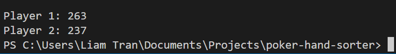
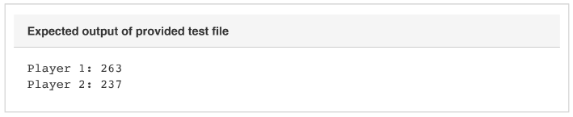

# poker-hand-sorter
### Card.java
Creates the playing card. Card properties are rank (card number) and their suits. 

### Player.java
Creates the Player object. Contains the methods for card combinations. You can also find the readRanks method in here which takes the rank as a String and returns it as an integer. In hindsight, this method should logically be located in the Card class. Woops!

### Game.java
This is where the game is executed and where the main function can be found. This class reads the user's input and creates two separate hands for player one
and player two. Methods for evaluating hand combinations and dealing with ties can also be found in this class

### Output

